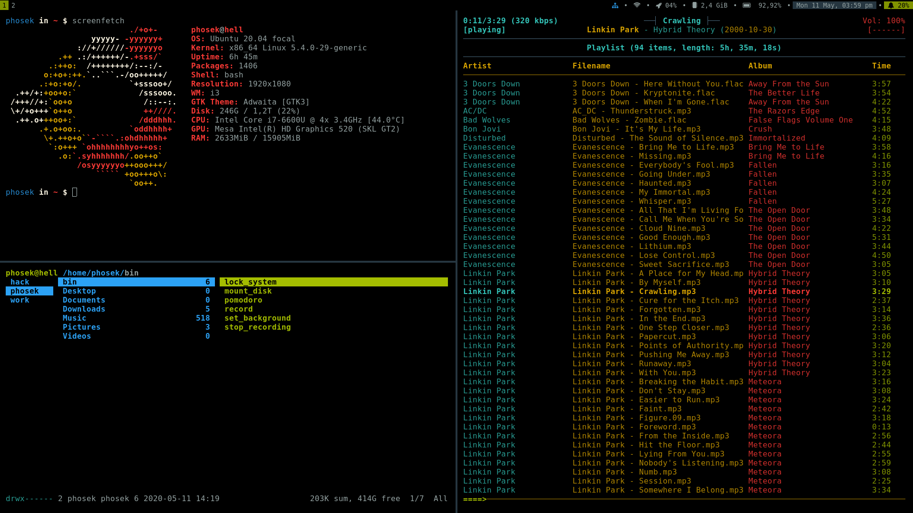
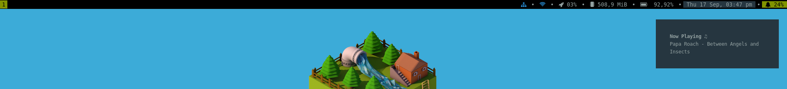

# i3-Desktop

My Configs For My i3 Desktop

## Dependencies
### Ubuntu

* `arandr`
* `arc-theme`
* `dmenu`
* `dunst`
* `feh`
* `ffmpeg`
* `fonts-font-awesome`
* `i3`
* `i3lock`
* `i3status`
* `libnotify-bin`
* `scrot`
* `ukui-greeter`
* `urxvt` set as default terminal
* `yaru-theme-icon`

## .env example

```bash
#!/usr/bin/env bash

ADMIN=user
PROFILES=user user2 user3

BIN_FILES=lock_system mount_disk pomodoro record set_background stop_recording
CONFIG_FILES=dunst htop i3 i3status mc redshift
HOME_FILES=.bash_profile .bashrc .profile .vimrc .Xmodmap .Xresources bin .mplayer .ncmpcpp
MKDIR=.config Documents/Development Downloads Music Pictures/Screenshot Videos
MNT_DIR=cd encrypted disk dvd fd img/p1 img/p2
DOCKER_UBUNTU_VER=eoan
UBUNTU_VER=focal
```

## Shortcuts

| Key                                | Purpose                                                    |
| ---------------------------------- | ---------------------------------------------------------- |
| $mod + Return                      | terminal                                                   |
| $mod + q                           | quit window                                                |
| $mod + d                           | dmenu                                                      |
| $mod + Ctrl + d                    | i3-dmenu-desktop                                           |
| $mod + j(k,l,uring)                | Focus left(down, up, right) window                         |
| $mod + x                           | Focus on latest urgent window                              |
| $mod + Left(Down,Up,Right)         | Focus left(down, up, right) window                         |
| $mod + Shift + j(k,l,uring)        | Move focused window left (down, up, right)                 |
| $mod + Shift + Left(Down,Up,Right) | Move focused window left (down, up, right)                 |
| $mod + h                           | Split the current container horizontally                   |
| $mod + v                           | Split the current container vertically                     |
| $mod + f                           | Fullscreen mode for the focused container                  |
| $mod + s                           | Change the current container layout (toogle split)         |
| $mod + w                           | Change the current container layout (stacking)             |
| $mod + e                           | Change the current container layout (tabbed)               |
| $mod + o                           | Move the whole workspace to the next output                |
| $mod + Shift + minus               | Make the currently focused window a scratchpad             |
| $mod + minus                       | Show the first a scratchpad window                         |
| $mod + Shift + space               | Toggle floating status of the focused container            |
| $mod + space                       | Change focus between tiling and floating windows           |
| $mod + a                           | Focus parent container                                     |
| $mod + (1-9,0)                     | Switch to workspaces with number 1-10                      |
| $mod + Shift + (1-9,0)             | Move the container to the workspaces with number 1-10      |
| $mod + Shift + c                   | Reload the configuration file                              |
| $mod + Shift + r                   | Restart I3 inplace                                         |
| $mod + Shift + e                   | Log out                                                    |
| $mod + r                           | Activate resize mode                                       |
| Mod1 + Ctrl + l                    | Loct the system                                            |
| Mod1 + Ctrl + delete               | Activate power mode (reboot, shutdown, suspend, hybernate) |
| Print                              | Activate print mode                                        |
| $mod + p                           | Activate display mode                                      |
| $mod + m                           | ncmpcpp                                                    |
| $mod + period                      | ranger                                                     |
| $mod + mod1 + m                    | notification with npc current playing                      |
| $mod + mod1 + i                    | notification with IP address                               |
| $mod + mod1 + p                    | notification with pomodoro status                          |
| $mod + mod1 + y                    | mpc prev                                                   |
| XF86AudioPrev                      | mpc prev                                                   |
| $mod + mod1 + x                    | mpc play                                                   |
| XF86AudioPlay                      | mpc play                                                   |
| $mod + mod1 + c                    | mpc toggle                                                 |
| $mod + mod1 + v                    | mpc stop                                                   |
| XF86AudioStop                      | mpc stop                                                   |
| $mod + mod1 + b                    | mpc next                                                   |
| XF86AudioNext                      | mpc next                                                   |
| XF86MonBrightnessUp                | xbacklight -inc 20                                         |
| XF86MonBrightnessDown              | xbacklight -dec 20                                         |
| XF86Calculator                     | xcalc                                                      |
| XF86AudioRaiseVolume               | pactl set-sink-volume 1 +5%                                |
| XF86AudioLowerVolume               | pactl set-sink-volume 1 -5%                                |
| XF86AudioMute                      | pactl set-sink-mute 1 toggle                               |
| $mod+KP_Add                        | pactl set-sink-volume 1 +5%                                |
| $mod+KP_Subtract                   | pactl set-sink-volume 1 -5%                                |
| $mod+KP_Multiply                   | pactl set-sink-mute 1 toggle                               |

mod1 = Alt key; mod4 = Win key ($mod) 

## Screenshots





i3lock


dunst (notification)


dmenu desktop


dmenu


power mode


print mode


display mode
