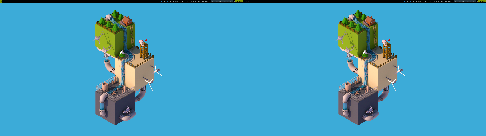
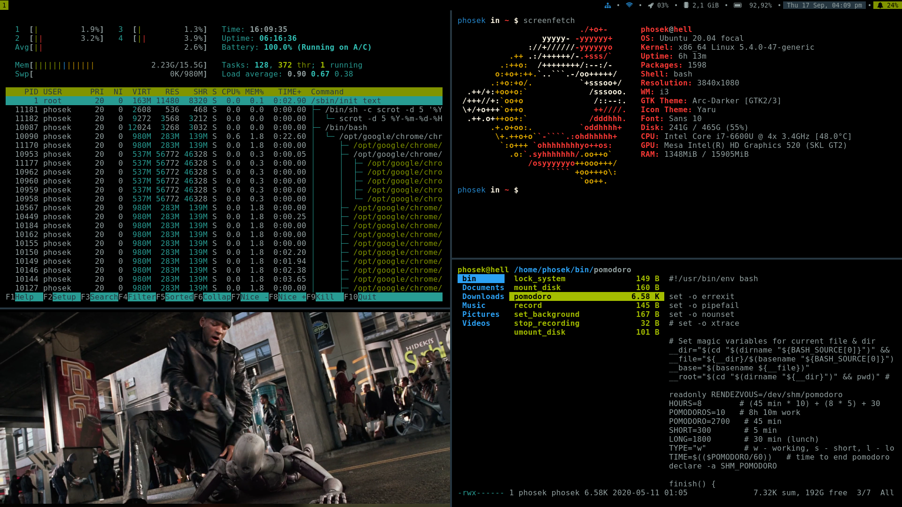
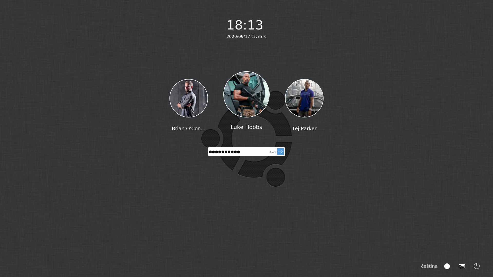

# i3-Desktop

My configs for i3 desktop. \
Wallpaper edit from [Keiraarts](https://www.behance.net/gallery/10698789/Isometric-Low-Poly-World).

All colors in the system are by Solarized dark (color scheme).

INFO:
* **distro:** Ubuntu 20.04 "Focal Fossa"
* **wm:** i3
* **bar:** i3status
* **lock screen:** i3lock
* **login manager:** ukui-greeter
* **terminal:** urxvt
* **shell:** bash
* **file manager:** ranger, mc
* **editor:** vim, Sublime Text 3
* **app launcher:** dmenu
* **gtk theme:** arc-theme
* **image viewer:** feh
* **notification:** dunst

RUN ON:
* **ntb:** DELL Latitude E7470
* **cpu:** Intel Core i7-6600U @ 4x 3.4GHz
* **ram:** 2x8GB DDR4 2133MHz
* **gpu:** Intel(R) HD Graphics 520 (SKL GT2)
* **disk:** Samsung 970 EVO NVMe M.2 SSD 500 GB

## Dependencies
### Ubuntu

* `arandr`
* `arc-theme`
* `dmenu`
* `dunst`
* `feh`
* `ffmpeg`
* `fonts-font-awesome`
* `i3`
* `i3lock`
* `i3status`
* `libnotify-bin`
* `scrot`
* `ukui-greeter`
* `urxvt` set as default terminal
* `yaru-theme-icon`


## .env example

```bash
#!/usr/bin/env bash

ADMIN=user
PROFILES=user user2 user3

BIN_FILES=lock_system mount_disk mpdnotify pomodoro record set_background stop_recording umount_disk
CONFIG_FILES=dunst htop i3 i3status mc redshift
HOME_FILES=.bash_profile .bashrc .profile .vimrc .XCalc .Xmodmap .Xresources bin .mplayer .ncmpcpp
MKDIR=.config Documents Downloads Music Pictures/Screenshot Videos
MNT_DIR=cd encrypted disk dvd fd img/p1 img/p2
DOCKER_UBUNTU_VER=eoan
UBUNTU_VER=focal
```

## Backups example
### etc

```bash
hosts
mpd.conf
nginx/sites-available
```

### opt

```bash
Postman
pi-gen
usbboot
```

### profiles

```bash
user/.config/dunst/
user/.config/gtk-3.0/settings.ini
user/.config/htop/
user/.config/i3/
user/.config/i3status/
user/.config/mc/
user/.config/redshift/
user/.mplayer/
user/.ncmpcpp/
user/Documents/
user/Downloads/
user/Pictures/
user/bin/
user/.XCalc
user/.Xmodmap
user/.Xresources
user/.bash_history
user/.bash_profile
user/.bashrc
user/.face
user/.gtkrc-2.0
user/.profile
user/.vimrc
user2/.config/dunst/
user2/.config/gtk-3.0/settings.ini
user2/.config/htop/
user2/.config/i3/
user2/.config/i3status/
user2/.config/mc/
user2/.config/redshift/
user2/.mplayer/
user2/.ncmpcpp/
user2/Documents/
user2/Downloads/
user2/Pictures/
user2/bin/
user2/.XCalc
user2/.Xmodmap
user2/.Xresources
user2/.bash_history
user2/.bash_profile
user2/.bashrc
user2/.face
user2/.gtkrc-2.0
user2/.profile
user2/.vimrc
user3/.config/dunst/
user3/.config/gtk-3.0/settings.ini
user3/.config/htop/
user3/.config/i3/
user3/.config/i3status/
user3/.config/mc/
user3/.config/redshift/
user3/.mplayer/
user3/.ncmpcpp/
user3/Documents/
user3/Downloads/
user3/Pictures/
user3/bin/
user3/.XCalc
user3/.Xmodmap
user3/.Xresources
user3/.bash_history
user3/.bash_profile
user3/.bashrc
user3/.face
user3/.gtkrc-2.0
user3/.profile
user3/.vimrc
```

## Install

* install Ubuntu minimal
  * [Ubuntu 20.04 "Focal Fossa" ](http://archive.ubuntu.com/ubuntu/dists/focal/main/installer-amd64/current/legacy-images/netboot/mini.iso)
  * [How to install Ubuntu from Minimal CD (with UEFI)](https://www.onetransistor.eu/2015/12/install-ubuntu-minimal-cd-uefi-enabled.html)
* `sudo apt update; sudo apt upgrade; sudo apt install git make`
* set `GRUB_CMDLINE_LINUX_DEFAULT="text"` and uncomment `GRUB_TERMINAL=console` in **/etc/default/grub**
* `sudo update-grub`
* `sudo mkdir /opt/i3-desktop`
* `sudo chown $USER:$USER /opt/i3-desktop`
* `git clone https://gitlab.com/pavelhosek89/i3-desktop.git /opt/i3-desktop`
* `cd /opt/i3-desktop`
* `make install-all`


## After install

* Sublime Text - install packages
  * BracketHighlighter
  * EditorConfig
  * Emmet
  * GitGutter
  * Increment Selection
  * Nette + Latte + Neon
  * PhpDoc
  * SFTP
  * SideBarEnhancements
  * Solarized Color Scheme
  * TrailingSpaces
  * Xdebug Client
* MPD - update music database
  * `ln -s ~/Music /var/lib/mpd/music`
  * `mpc update`
* Vim - install plugins
  * `vim +PluginInstall +qall` - run under all users
* systemctl - disable unnecessary services
  * `sudo systemctl disable accounts-daemon.service`
  * `sudo systemctl disable apport.service`
  * `sudo systemctl disable apt-daily-upgrade.timer`
  * `sudo systemctl disable apt-daily.timer`
  * `sudo systemctl disable ModemManager.service`
  * `sudo systemctl disable NetworkManager-wait-online.service`
  * `sudo systemctl disable NetworkManager.service`
  * `sudo systemctl disable pppd-dns.service`
* journalctl - repair error
  * comment line in **/etc/pam.d/lightdm** and **/etc/pam.d/lightdm-greeter** where is **pam_gnome_keyring.so** or **pam_kwallet.so** or **pam_kwallet.so**
  * delete user start service for mpd and dunst: `sudo rm /usr/lib/systemd/user/dunst.service`, `sudo rm /usr/lib/systemd/user/mpd.service`, `sudo rm /usr/lib/systemd/user/mpd.socket`
  * set **zeroconf_enabled** to “no” in **/etc/mpd.conf**
  * set **COMPRESS=gzip** in **/etc/initramfs-tools/initramfs.conf** and run `sudo update-initramfs -u`
* permissions - set, if do have instalation without restore data
  * `sudo find /home/$USER/ -type f -exec chmod 644 {} \;`
  * `sudo find /home/$USER/ -type d -exec chmod 755 {} \;`
* set GKT3 and GTK2 in lxappearance
  * `lxappearance`


## Shortcuts

| Key                                | Purpose                                                    |
| ---------------------------------- | ---------------------------------------------------------- |
| $mod + Return                      | terminal                                                   |
| $mod + q                           | quit window                                                |
| $mod + d                           | dmenu                                                      |
| $mod + Ctrl + d                    | i3-dmenu-desktop                                           |
| $mod + j(k,l,uring)                | Focus left(down, up, right) window                         |
| $mod + x                           | Focus on latest urgent window                              |
| $mod + Left(Down,Up,Right)         | Focus left(down, up, right) window                         |
| $mod + Shift + j(k,l,uring)        | Move focused window left (down, up, right)                 |
| $mod + Shift + Left(Down,Up,Right) | Move focused window left (down, up, right)                 |
| $mod + h                           | Split the current container horizontally                   |
| $mod + v                           | Split the current container vertically                     |
| $mod + f                           | Fullscreen mode for the focused container                  |
| $mod + s                           | Change the current container layout (toogle split)         |
| $mod + w                           | Change the current container layout (stacking)             |
| $mod + e                           | Change the current container layout (tabbed)               |
| $mod + o                           | Move the whole workspace to the next output                |
| $mod + Shift + minus               | Make the currently focused window a scratchpad             |
| $mod + minus                       | Show the first a scratchpad window                         |
| $mod + Shift + space               | Toggle floating status of the focused container            |
| $mod + space                       | Change focus between tiling and floating windows           |
| $mod + a                           | Focus parent container                                     |
| $mod + (1-9,0)                     | Switch to workspaces with number 1-10                      |
| $mod + Shift + (1-9,0)             | Move the container to the workspaces with number 1-10      |
| $mod + Shift + c                   | Reload the configuration file                              |
| $mod + Shift + r                   | Restart I3 inplace                                         |
| $mod + Shift + e                   | Log out                                                    |
| $mod + r                           | Activate resize mode                                       |
| Mod1 + Ctrl + l                    | Loct the system                                            |
| Mod1 + Ctrl + delete               | Activate power mode (reboot, shutdown, suspend, hybernate) |
| Print                              | Activate print mode                                        |
| $mod + p                           | Activate display mode                                      |
| $mod + m                           | ncmpcpp                                                    |
| $mod + period                      | ranger                                                     |
| $mod + mod1 + m                    | notification with npc current playing                      |
| $mod + mod1 + i                    | notification with IP address                               |
| $mod + mod1 + p                    | notification with pomodoro status                          |
| $mod + mod1 + y                    | mpc prev                                                   |
| XF86AudioPrev                      | mpc prev                                                   |
| $mod + mod1 + x                    | mpc play                                                   |
| XF86AudioPlay                      | mpc play                                                   |
| $mod + mod1 + c                    | mpc toggle                                                 |
| $mod + mod1 + v                    | mpc stop                                                   |
| XF86AudioStop                      | mpc stop                                                   |
| $mod + mod1 + b                    | mpc next                                                   |
| XF86AudioNext                      | mpc next                                                   |
| XF86MonBrightnessUp                | xbacklight -inc 20                                         |
| XF86MonBrightnessDown              | xbacklight -dec 20                                         |
| XF86Calculator                     | xcalc                                                      |
| XF86AudioRaiseVolume               | pactl set-sink-volume 0 +5%                                |
| XF86AudioLowerVolume               | pactl set-sink-volume 0 -5%                                |
| XF86AudioMute                      | pactl set-sink-mute 0 toggle                               |
| $mod+KP_Add                        | pactl set-sink-volume 0 +5%                                |
| $mod+KP_Subtract                   | pactl set-sink-volume 0 -5%                                |
| $mod+KP_Multiply                   | pactl set-sink-mute 0 toggle                               |

mod1 = Alt key; mod4 = Win key ($mod)


## Screenshots

desktop - single monitor


desktop - dual monitor


htop, mplayer, screenfetch, ranger


login screen


i3lock


dunst (notification)


dmenu desktop


dmenu


power mode


print mode


display mode
