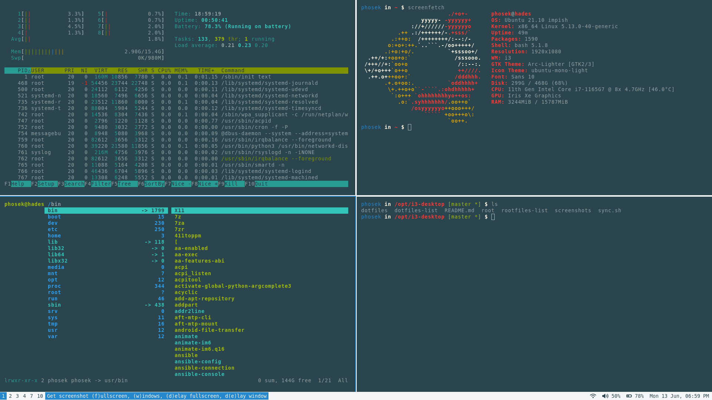
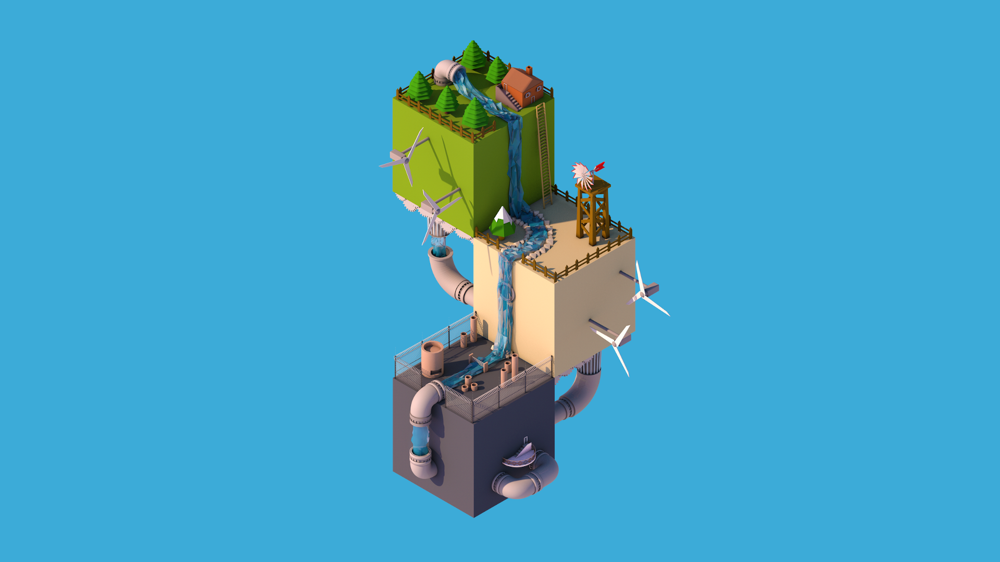
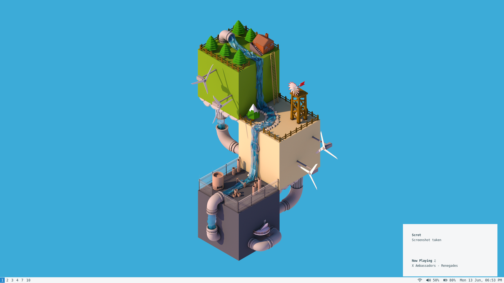

# i3-desktop

My configs for i3 desktop. \
Wallpaper edit from [Keiraarts](https://www.behance.net/gallery/10698789/Isometric-Low-Poly-World).

All colors in the system are by Solarized dark (color scheme).

INFO:
* **distro:** Ubuntu 20.04 "Focal Fossa" | Ubuntu 20.10 "Groovy Gorilla" | Ubuntu 21.04 "Hirsute Hippo"
* **wm:** i3
* **bar:** i3status
* **lock screen:** i3lock
* **login manager:** console (login under TTY1 starts i3)
* **terminal:** urxvt
* **shell:** bash
* **file manager:** ranger, mc
* **editor:** vim, Sublime Text 3
* **app launcher:** dmenu
* **gtk theme:** arc-theme
* **image viewer:** feh
* **notification:** dunst

**RUN ON:**

NTB-old:
* **ntb:** DELL Latitude E7470
* **cpu:** Intel Core i7-6600U @ 2x 3.4GHz HT
* **ram:** 2x8GB DDR4 2133MHz
* **gpu:** Intel(R) HD Graphics 520 (SKL GT2)
* **disk:** Samsung 970 EVO NVMe M.2 SSD 500 GB

NTB-new
* **ntb:** Lenovo IdeaPad 5 14ITL05
* **cpu:** Intel Core i7-1167G7 @ 4x 4.7GHz HT
* **ram:** 2x8GB DDR4 3200MHz
* **gpu:** Intel(R) Iris(R) Xe Graphics (TL GT2)
* **disk:** SK Hynix BC711 NVMe M.2 SSD 512 GB

PC-old:
* **pc:** Acer Aspire TC-780
* **cpu:** Intel Core i5-7400 @ 4x 3.5GHz
* **ram:** 2x8GB DDR4 2400MHz
* **gpu:** Intel(R) HD Graphics 630 (KBL GT2)
* **disk:** SK Hynix SC308 SATAIII M.2 SSD 128GB

PC-new:
* **pc:** custom
* **mtb:** MSI MAG B460 TORPEDO
* **cpu:** Intel Core i5-10400F @ 6x 4.3GHz HT
* **ram:** 2x8GB DDR4 2666MHz CL13
* **gpu:** NVIDIA GeForce GTX 1050
* **disk:** Samsung 970 EVO Plus NVMe M.2 SSD 500GB
* **disk:** TOSHIBA DT01ACA1 SATA 6G HDD 1TB

## Dependencies
### Ubuntu

* `arandr`
* `arc-theme`
* `dmenu`
* `dunst`
* `feh`
* `ffmpeg`
* `fonts-font-awesome`
* `i3`
* `i3lock`
* `i3status`
* `libnotify-bin`
* `scrot`
* `urxvt` set as default terminal
* `yaru-theme-icon`

## Shortcuts

| Key                                | Purpose                                                    |
| ---------------------------------- | ---------------------------------------------------------- |
| $mod + Return                      | terminal                                                   |
| $mod + q                           | quit window                                                |
| $mod + d                           | dmenu                                                      |
| $mod + Ctrl + d                    | i3-dmenu-desktop                                           |
| $mod + j(k,l,uring)                | Focus left(down, up, right) window                         |
| $mod + x                           | Focus on latest urgent window                              |
| $mod + Left(Down,Up,Right)         | Focus left(down, up, right) window                         |
| $mod + Shift + j(k,l,uring)        | Move focused window left (down, up, right)                 |
| $mod + Shift + Left(Down,Up,Right) | Move focused window left (down, up, right)                 |
| $mod + h                           | Split the current container horizontally                   |
| $mod + v                           | Split the current container vertically                     |
| $mod + f                           | Fullscreen mode for the focused container                  |
| $mod + s                           | Change the current container layout (toogle split)         |
| $mod + w                           | Change the current container layout (stacking)             |
| $mod + e                           | Change the current container layout (tabbed)               |
| $mod + o                           | Move the whole workspace to the next output                |
| $mod + Shift + minus               | Make the currently focused window a scratchpad             |
| $mod + minus                       | Show the first a scratchpad window                         |
| $mod + Shift + space               | Toggle floating status of the focused container            |
| $mod + space                       | Change focus between tiling and floating windows           |
| $mod + a                           | Focus parent container                                     |
| $mod + (1-9,0)                     | Switch to workspaces with number 1-10                      |
| $mod + Shift + (1-9,0)             | Move the container to the workspaces with number 1-10      |
| $mod + Shift + c                   | Reload the configuration file                              |
| $mod + Shift + r                   | Restart I3 inplace                                         |
| $mod + Shift + e                   | Log out                                                    |
| $mod + r                           | Activate resize mode                                       |
| Mod1 + Ctrl + l                    | Loct the system                                            |
| Mod1 + Ctrl + delete               | Activate power mode (reboot, shutdown, suspend, hybernate) |
| Print                              | Activate print mode                                        |
| $mod + p                           | Activate display mode                                      |
| $mod + n                           | Activate notification mode                                 |
| $mod + m                           | ncmpcpp                                                    |
| $mod + period                      | ranger                                                     |
| $mod + c                           | pavucontrol                                                |
| $mod + mod1 + y                    | mpc prev                                                   |
| XF86AudioPrev                      | mpc prev                                                   |
| $mod + mod1 + x                    | mpc play                                                   |
| XF86AudioPlay                      | mpc play                                                   |
| $mod + mod1 + c                    | mpc toggle                                                 |
| $mod + mod1 + v                    | mpc stop                                                   |
| XF86AudioStop                      | mpc stop                                                   |
| $mod + mod1 + b                    | mpc next                                                   |
| XF86AudioNext                      | mpc next                                                   |
| XF86MonBrightnessUp                | xbacklight -inc 10                                         |
| XF86MonBrightnessDown              | xbacklight -dec 10                                         |
| XF86Calculator                     | urxvt -name calc -e calc                                   |
| XF86AudioRaiseVolume               | pactl set-sink-volume @DEFAULT_SINK@ +5%                   |
| XF86AudioLowerVolume               | pactl set-sink-volume @DEFAULT_SINK@ -5%                   |
| XF86AudioMute                      | pactl set-sink-mute @DEFAULT_SINK@ toggle                  |
| $mod+KP_Add                        | pactl set-sink-volume @DEFAULT_SINK@ +5%                   |
| $mod+KP_Subtract                   | pactl set-sink-volume @DEFAULT_SINK@ -5%                   |
| $mod+KP_Multiply                   | pactl set-sink-mute @DEFAULT_SINK@ toggle                  |

mod1 = Alt key; mod4 = Win key ($mod)

## Screenshots

desktop - single monitor

htop, mc, screenfetch, ranger

i3lock

dunst (notification)

dmenu desktop

dmenu

power mode

print mode

display mode

notify mode
